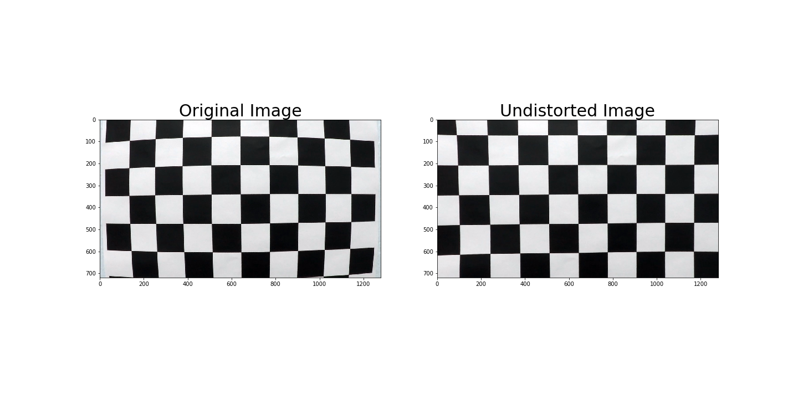

## Advanced Lane Finding

The Project
---

The goals / steps of this project are the following:

* Compute the camera calibration matrix and distortion coefficients given a set of chessboard images.
* Apply a distortion correction to raw images.
* Use color transforms, gradients, etc., to create a thresholded binary image.
* Apply a perspective transform to rectify binary image ("birds-eye view").
* Detect lane pixels and fit to find the lane boundary.
* Determine the curvature of the lane and vehicle position with respect to center.
* Warp the detected lane boundaries back onto the original image.
* Output visual display of the lane boundaries and numerical estimation of lane curvature and vehicle position.

The main files that were used in this project are the following: 
* [advanced_lane_finding.py](advanced_lane_finding.py) - used to create some of the visuals that are used in this readme
* [advanced_lane_finding.ipynb](advanced_lane_finding.ipynb) - the jupyter notebook where everything is put together and processes the video
* [utils.py](utils.py) - contains a bunch of utility functions for things like sliding window calculations, pipeline functions, ditortion etc.
* [line.py](line.py) - contains the LaneLines and Lines classes that helps us keep track of the current state of lane line detection

## Camera Calibration
The camera was calibrated using the given checkboard images in [camera_cal](camera_cal). It uses the function in [utils.py](utils.py) get_calibration_points to get the points in 3d space and in 2d image space. 

From there we use cv2.undistort and store the results in a pickle that used by the undistorter_from_pickle function in [utils.py](utils.py) which returns another function that will be used in our pipeline.

Here's an example of an image that underwent distortion correction:

## Pipeline
## Perspective Transform
## Line detection - Sliding Windows

