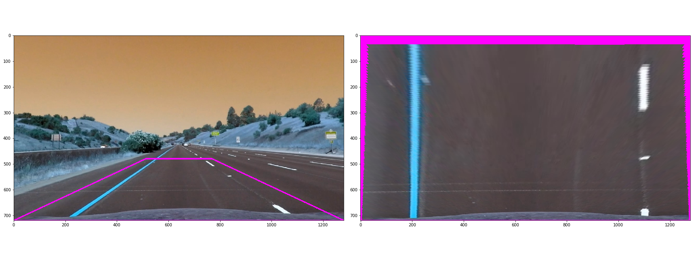

## Advanced Lane Finding

The Project
---

The goals / steps of this project are the following:

* Compute the camera calibration matrix and distortion coefficients given a set of chessboard images.
* Apply a distortion correction to raw images.
* Use color transforms, gradients, etc., to create a thresholded binary image.
* Apply a perspective transform to rectify binary image ("birds-eye view").
* Detect lane pixels and fit to find the lane boundary.
* Determine the curvature of the lane and vehicle position with respect to center.
* Warp the detected lane boundaries back onto the original image.
* Output visual display of the lane boundaries and numerical estimation of lane curvature and vehicle position.

The main files that were used in this project are the following: 
* [advanced_lane_finding.py](advanced_lane_finding.py) - used to create some of the visuals that are used in this readme
* [advanced_lane_finding.ipynb](advanced_lane_finding.ipynb) - the jupyter notebook where everything is put together and processes the video
* [utils.py](utils.py) - contains a bunch of utility functions for things like sliding window calculations, pipeline functions, ditortion etc.
* [line.py](line.py) - contains the LaneLines and Lines classes that helps us keep track of the current state of lane line detection

## Camera Calibration
The camera was calibrated using the given checkboard images in [camera_cal](camera_cal). It uses the function in [utils.py](utils.py) `get_calibration_points` to get the points in 3d space and in 2d image space. 

From there we use cv2.undistort and store the results in a pickle that used by the `undistorter_from_pickle` function in [utils.py](utils.py) which returns another function that will be used in our pipeline.

Here's an example of an image that underwent distortion correction:

## Sobel and HSL Channel Filtering
In addition to first undistorting the images, I applied a sobel filter in the x direction, and also filtered the 's' and 'l' channels of the image. From there, the image was converted to a binary image.

The above is done in the [utils.py](utils.py) within the `pipeline` function.

The result of this pipeline function is shown below:

## Perspective Transform
To obtain the bird's eye view of the lane, I chose an arbitraty set of points that is illutrated in the region highlighted in the image below. Alongside that image is the resulting birds eye view.

The perspective transform code is done in [utils.py](utils.py) in `get_warper_from_image_shape` which returns a warper function that will be used in our pipeline.  

## Result of complete pipeline

## Line detection - Sliding Windows
After applying the complete pipeline, we use a sliding window algorithm to detect the lines. The main function used here is `sliding_windows_lane_pixels` from [utils.py](utils.py). This function returns the x,y pixel values for right and left lane lines. From there we can find the polynomial fit of each line and also find the drawing x,y coordinates for the fitted lines.

An illustration of the sliding window algorithm is shown here:

Once we find the line of best fits using the sliding window algorithm, we use the `next_frame_search` function in [utils.py](utils.py) to do an incremental search based of last 'best fit' lines that were found in the previous search.

## Line Curvature and Respect to Center
The line cuvature and respect to center were calculating using the `calc_radius` and `calc_offset` in [utils.py](utils.py).

## Converting the warped image back
You can see how this is done in the jupyter notebook [advanced_lane_finding.ipynb](advanced_lane_finding.ipynb) in code cell 5 within the `process_image` function. 

## Putting it all together
The complete pipeline is used within the jupyter notebook [advanced_lane_finding.ipynb](advanced_lane_finding.ipynb) to process the video. I also created a `LaneLines` class that keeps track of the current state of each left and right line (which is of class `Line`). The LaneLine class will process the warped image and apply either a sliding window search or an incremental search depending on if there are previous detected lines or if a reset was initiated as a result of a problematic frame. For the time being, the only sanity check that will cause a reset is if the curvature of a lane line found is unrealistic. In that case, we reuse the previously found line and initiate a new window search in the next frame.

## The resulting video
The resulting video is in [lane_found_output.mp4](lane_found_output.mp4).

## Reflections and Improvements
I found this project to be very challenging as there were a lot of individual steps to understand and parameters to tune. Eventhough I was able to get a reasonable output on the project video, there are still plenty of improvements that can be done to make my solution more robuts. I'll list them below:
* add more sanity checks in my lane finding algorithm such as checking the similarity of the right/left line and also checking if the right and left lines are parallel
* improve my pipeline in particular my edge detection algorithm using sobel and filtering 's' and 'l' channels. Currently, my pipeline does very poorly against shadows as the shadows distort the detection of the lanes. I would try a dynamic thresholding method suggested in the forums that's based on the brightness of the image.

